# DSA using Java 

This repository contains Java programs for learning and practising basic, intermediate and advanced data structures and algorithms.

Along with that, there is an entire structured workflow to demonstrate how to:
- Make a folder for this project using the Command Prompt
- Create JAVA files for individual pieces of code using Command Prompt
- Open these JAVA files in VSCode using Command Prompt
- Run them in the VSCode Terminal
- Add 'git' to the folder
- Add individual files (Main.java, BubbleSort2.java etc.) to the main branch with commit messages
- Create a separate 'branch'
- Add file(s) to the separate 'branch' with commit messages
- Moving back to the 'main branch'
- Checking which 'git branch' command is currently at
- Create README.md file for the whole repository
- Make changes to the README.md file and push the file with commit messages 

## Important Git Commands:

- git init                             : Initializes a new Git repository in the current folder
- git status                           : Shows the current state of the working directory and staging area, helpful to check changes
- git add <filename>                   : Stages specific file(s) for the next commit. Example: git add README.md
- git add .                            : Stages all changed files (new, modified, deleted) in the directory for commit
- git commit -m "message"              : Commits the staged changes with a meaningful message. Example: git commit -m "Updated README"
- git log                              : Displays the commit history (author, date, commit hash, and message)
- git remote add origin <URL>          : Links your local repo to a remote GitHub repo (first-time setup)
- git remote -v                        : Shows the current remote URL(s) linked to your repo
- git push -u origin main              : Pushes commits to the main branch on GitHub and sets upstream tracking
- git push                             : Pushes local commits to the corresponding branch on the remote repo
- git branch                           : Lists all local branches and highlights the current branch
- git checkout -b branch <branch-name> : Creates a new branch and switches to it immediately
- git switch <branch-name>             : Switches between branches (modern alternative to checkout)
- git diff                             : Shows the differences between modified files and the last commit or between branches
- git clone <repo-url>                 : Clones a remote repository to your local machine
- git pull                             : Fetches and merges changes from the remote repository to the current branch

## Command Line prompts

### Navigating to the current folder: 
- 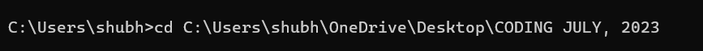 

### Making a new folder for DSA programs in JAVA:
- 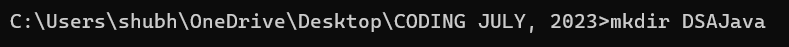

### Navigating to the newly created folder:
- 

### Create an empty CLASS:
- 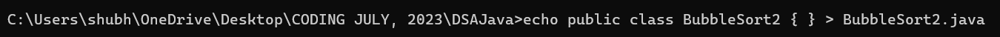

### Open the CLASS in VSCode: 
- 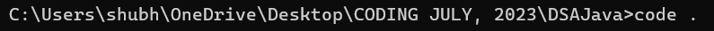

### Execute or Run the CLASS in VSCode Terminal:
- 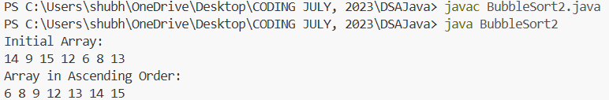

### Add 'git' to the Project Folder:
- 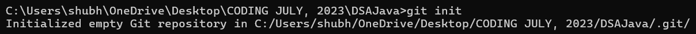

### Add a remote repository to your local git repository:
- 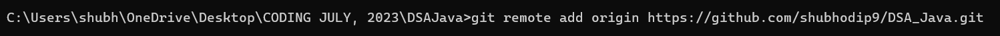
- 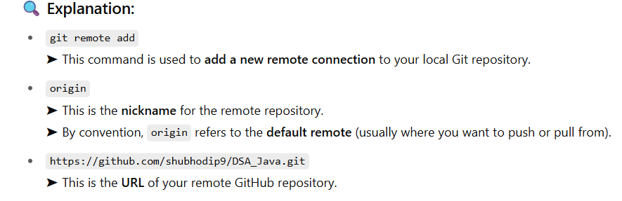
- 'local branch': on PC

### Explanation for 'remote':
- 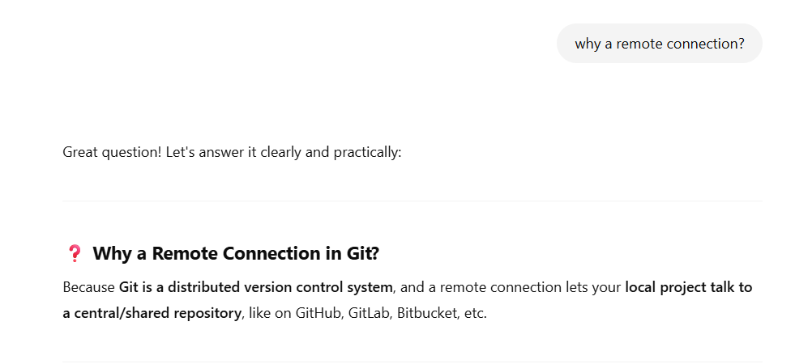
- 'remote branch': on Github

### Explanation for 'origin':
- 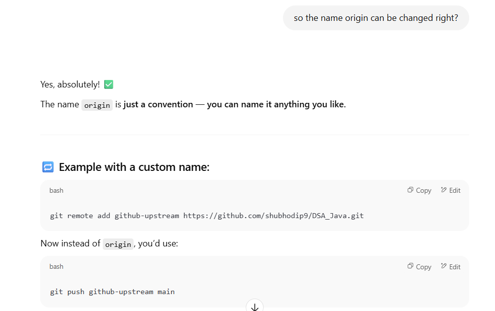

### Explanation for 'local Git repository':
- 
- 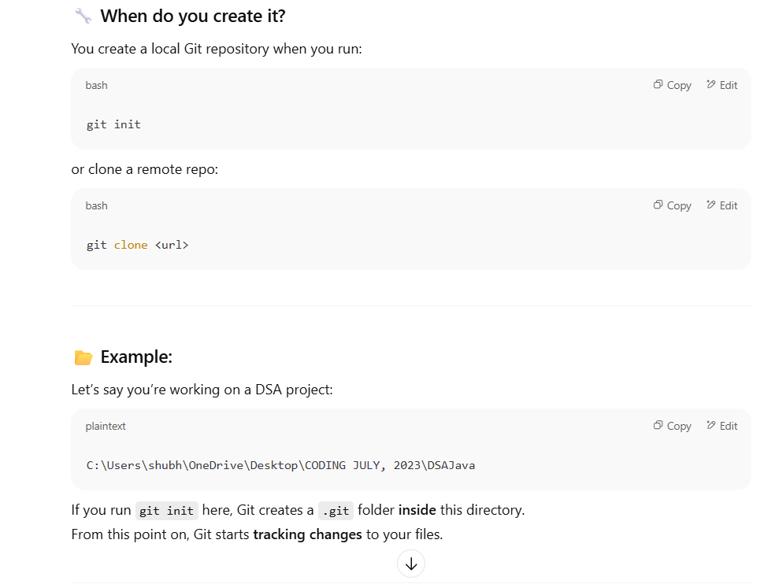
- 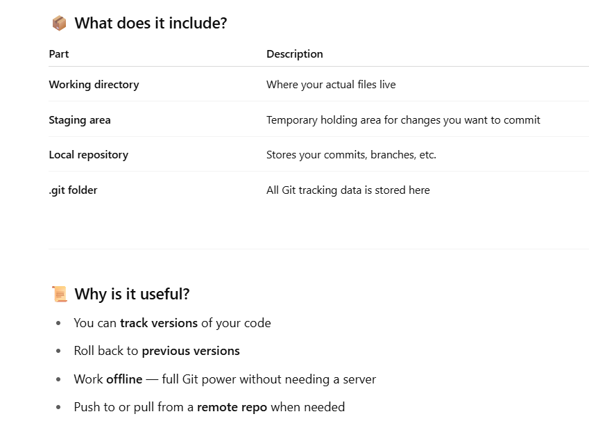

### Adding a file to the staging area / Stage the file:
- 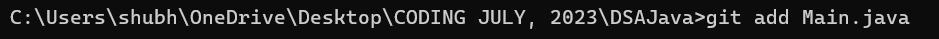

### Committing the file with a commit message:
- 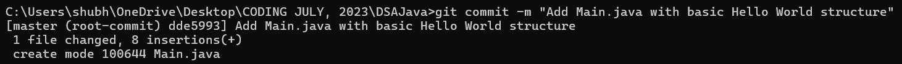

### Renaming the branch to 'main':
- 
- 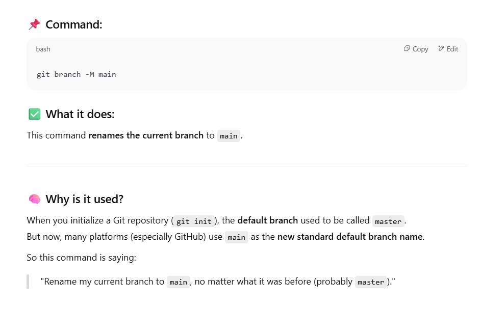
- 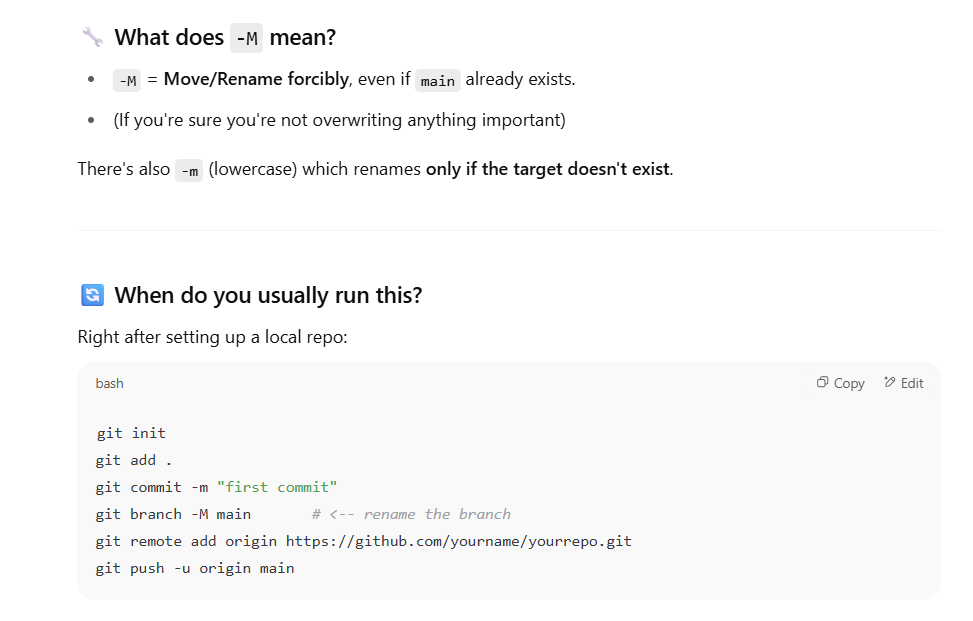
- 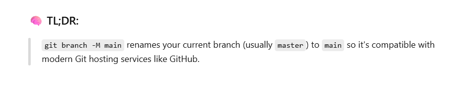

### 'push origin main' to Git:
- 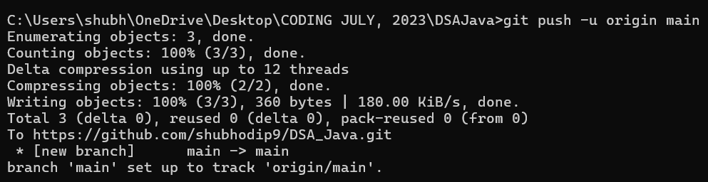
- 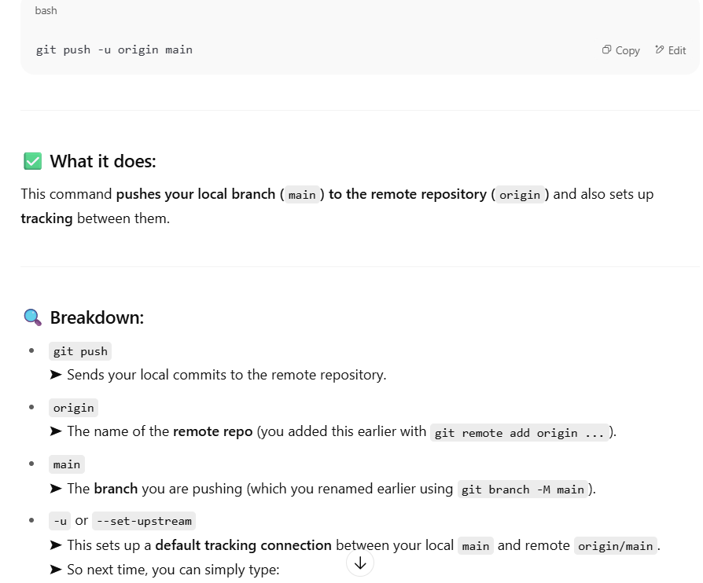
- 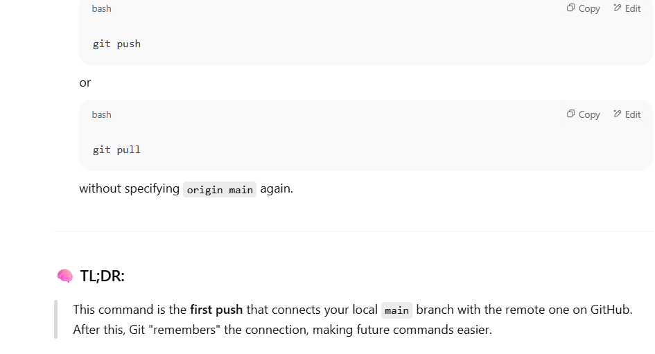

### List all local branches and show which branch user is currently at - 'git branch':
- 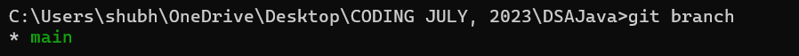

### 'git checkout main':
- 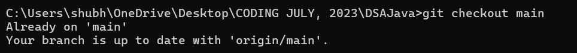
- 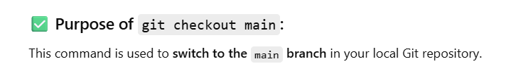

### Adding, Committing and Pushing another class to 'main branch':
- 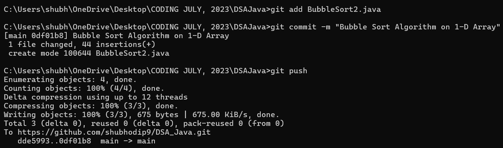

### Creating a 'new branch':
- 

### Adding, Committing and Pushing a class to the 'new branch':
- 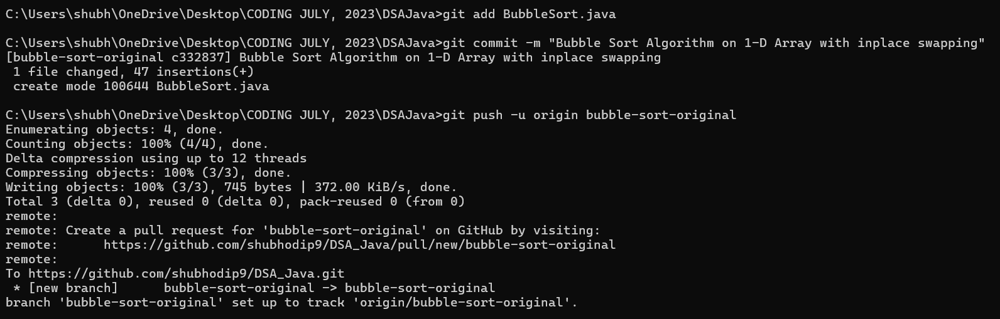

### Shifting to 'main branch':
- 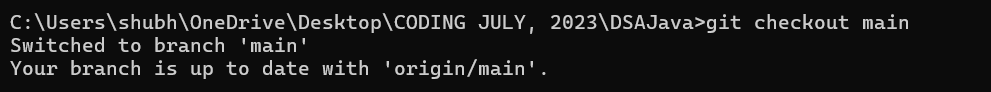

### Creating, Adding, Committing and Pushing a 'README.md' file:
- 

### Opening the README.md file in VSCode:
- 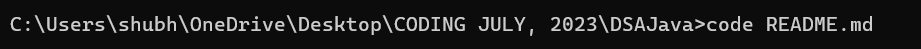

### Listing all branches of the Github repo (local + remote):
- 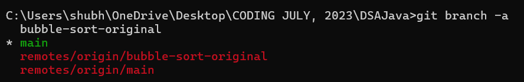
- 'git branch': only lists the local branches(on PC) not the remote ones(on Github)
- 'git branch -a': lists all local and remote branches

### Listing all branches of the Github repo and visualising in a Tree form:
- 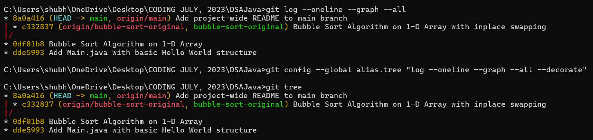

### Checking which branch user is currently on:
- 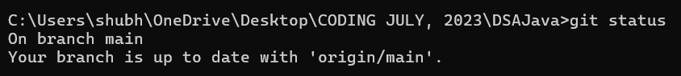

### Listing the entire folder on the local drive:
- 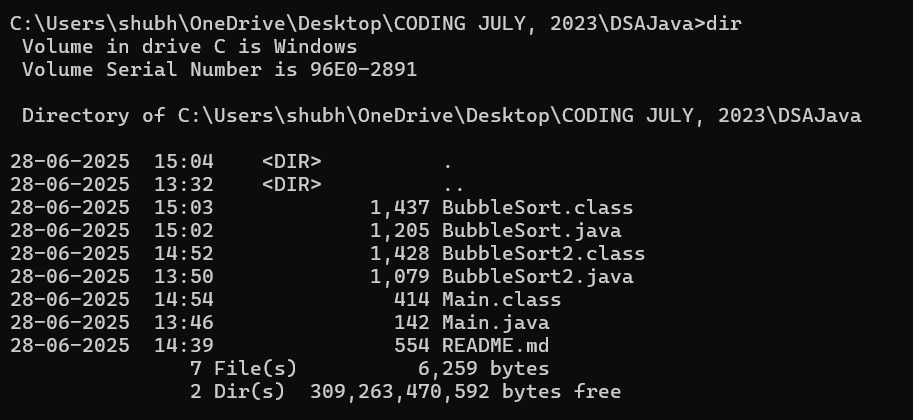

### Listing the entire folder with space occupied on the local drive:
- 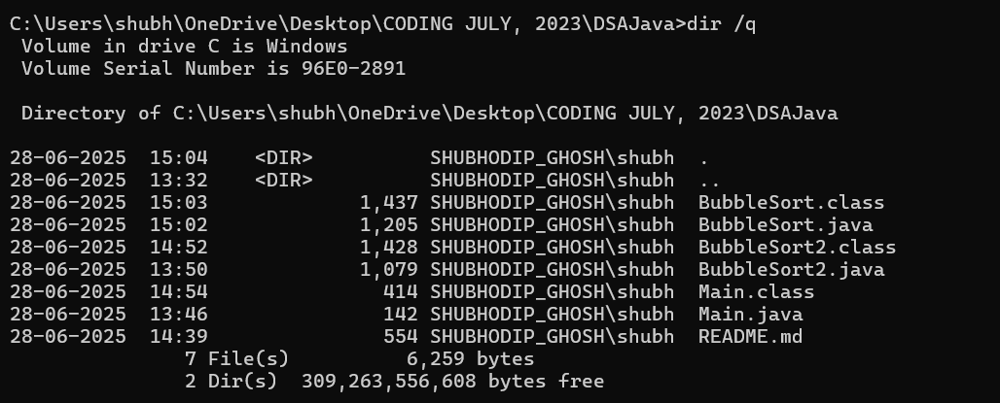

### Listing only the JAVA files of the folder on the local drive:
- 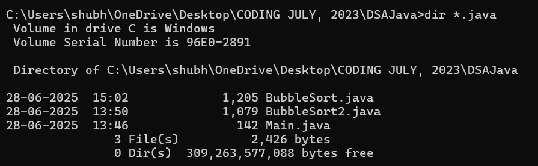

### Checking git status before pushing README.md:
- 

### Pushing '/Images' (Images folder) to Github:
- 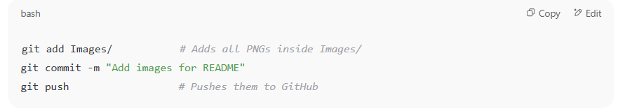
- If you want your images to display correctly on GitHub, then you must push the 'Images/' folder (and all the .png files inside it) to the GitHub repository.
- GitHub renders your README.md directly from the repo, so if the images aren't there, the links will break.

### Pushing the changes in README to Github:
- 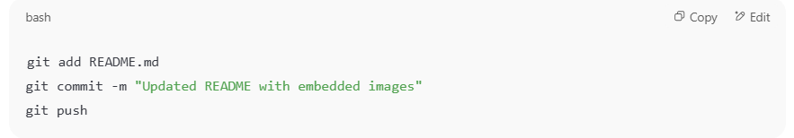

## Contents

- Screenshots of Command lines in the Command Prompt
- JAVA classes
- `Main.java`: Hello World setup
- `BubbleSort.java`: Classic Bubble Sort with inline logic
- `BubbleSort2.java`: Modular Bubble Sort using separate Swap function

## Branches

- `main`: Contains stable files (`Main.java`, `BubbleSort2.java`)
- `bubble-sort-original`: Contains the original `BubbleSort.java` (with in-place swapping)

